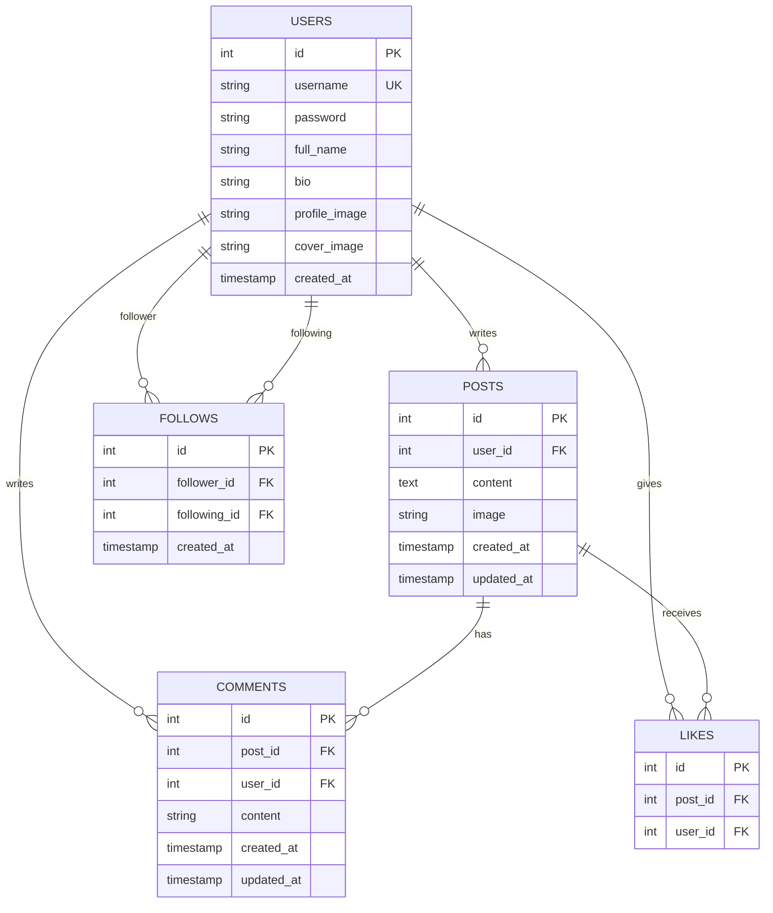

# SOciaLINK - Entity Relationship Diagram

```mermaid
erDiagram
    USERS ||--o{ POSTS : writes
    USERS ||--o{ COMMENTS : writes
    POSTS ||--o{ COMMENTS : has
    USERS ||--o{ LIKES : gives
    POSTS ||--o{ LIKES : receives
    USERS ||--o{ FOLLOWS : "follower"
    USERS ||--o{ FOLLOWS : "following"

    USERS    { int id PK  string username UK  string password  string full_name  string bio  string profile_image  string cover_image  timestamp created_at }
    POSTS    { int id PK  int user_id FK  text content  string image  timestamp created_at  timestamp updated_at }
    COMMENTS { int id PK  int post_id FK  int user_id FK  string content  timestamp created_at  timestamp updated_at }
    LIKES    { int id PK  int post_id FK  int user_id FK }
    FOLLOWS  { int id PK  int follower_id FK  int following_id FK  timestamp created_at }
```

Paste the block above into https://mermaid.live to export it as PNG/SVG for your documentation.
